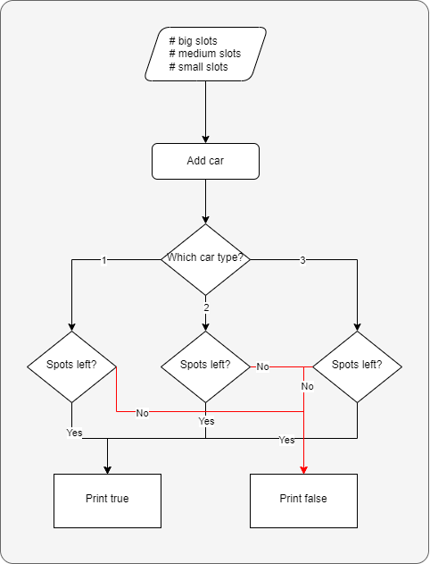

1. Create the `ParkingSystem` class
   - Attributes:
      - BigSlot: number of free big slots
      - MediumSlot: number of free medium slots
      - SmallSlot: number of free small slots
    - Behaviors:
      - AddCar: remove a slot of the given type and return wether there's free space or not
2. Create the `Main` class
   - Input the number of slots for each car type
   - Input the type of car to park
   - Output if there's space left for the car

